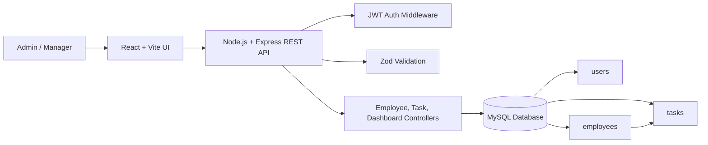

# Architecture Diagram

## Request Flow

1. User signs in from the React app.
2. Express validates credentials against the `users` table and returns a JWT.
3. React stores the JWT in local storage and sends it with protected API calls.
4. Auth middleware verifies the token before employee and task endpoints run.
5. Controllers validate input, execute MySQL queries, and return JSON responses.
